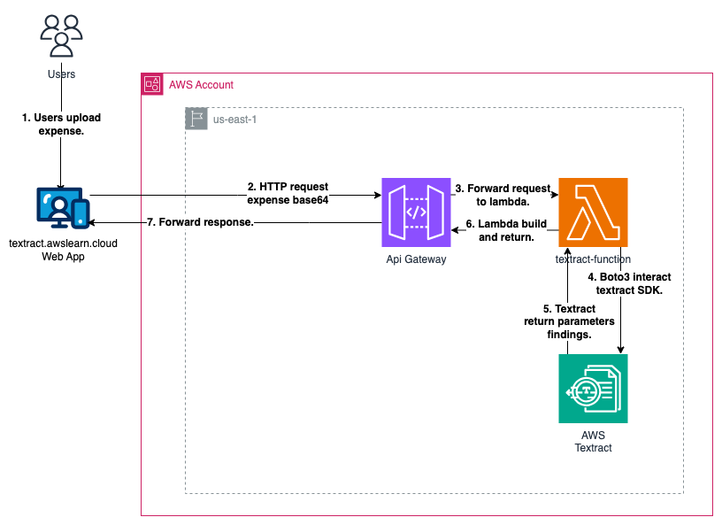

# AWS Textract implementation

Amazon Textract is a machine learning (ML) service that automatically extracts text, handwriting, layout elements, and data from scanned documents. It goes beyond simple optical character recognition (OCR) to identify, understand, and extract specific data from documents. Today, many companies manually extract data from scanned documents such as PDFs, images, tables, and forms, or through simple OCR software that requires manual configuration (which often must be updated when the form changes). To overcome these manual and expensive processes, Textract uses ML to read and process any type of document, accurately extracting text, handwriting, tables, and other data with no manual effort. You can use one of our pretrained or custom features to quickly automate document processing, whether you’re automating loans processing or extracting information from invoices and receipts. Textract provides you the ability to customize our pretrained features to meet the document processing needs specific to your business. Textract can extract the data in minutes instead of hours or days. "[AWS Official documentation](https://aws.amazon.com/textract/?nc1=h_ls "AWS Official documentation")"



## Flow Explanation

1. The process begins with the user uploading an expense image through the frontend application.

2. Following the upload, the user triggers the "extract information" action within the application.

3. The web application, in response to the user's action, initiates an HTTP request to an Api Gateway endpoint. This request includes essential image information encoded in base64 format.

4. The Api Gateway acts as an intermediary, forwarding the received request to a Lambda function within the Lambda function, the Boto3 SDK for Python facilitates interaction with the AWS Textract service. This involves sending the image data to Textract for processing and information extraction.

5. Upon receiving the processed results from AWS Textract, the Lambda function compiles the detected fields within the image. Subsequently, the Lambda function sends the response back to the frontend application, completing the flow.

## Prerequisites:

- [AWS CLI installed](https://docs.aws.amazon.com/cli/latest/userguide/getting-started-install.html "AWS CLI installed").

- [AWS SAM CLI installed](https://docs.aws.amazon.com/serverless-application-model/latest/developerguide/install-sam-cli.html "AWS SAM CLI installed").

- [Configure AWS credentials profile](https://docs.aws.amazon.com/cli/latest/userguide/cli-chap-configure.html "Configure AWS credentials profile").

# How deploy the AWS elements

To deploy the Api Gateway, the lambda function and the execution IAM role please execute the following SAM command in the root folder:

```
sam deploy --stack-name aws-textract \
--template-file template.yaml \
--capabilities CAPABILITY_NAMED_IAM \
--resolve-s3 \
--profile <your_aws_local_profile>
```

Remember to replace <your_aws_local_profile> for your AWS profile configured in case that you need to use a different profile instead of default profile.

# Running the Web App in a Local Environment

Follow these steps to run the web application locally:

1. Navigate to the textract-web-app folder.

2. Ensure that Node.js is installed. It is recommended to use Node Version Manager (NVM) to manage different Node.js versions. If you don't have NVM installed, you can follow the installation guide [here](https://www.freecodecamp.org/news/node-version-manager-nvm-install-guide/). The recommended Node.js version is v20.

3. Open a terminal and execute the command yarn install to install the project dependencies.

4. Once the installation is complete, run the command yarn dev. This will start the development server, and you can access the project by navigating to localhost:9090 in your web browser.

By following these steps, you should have the web application up and running on your local environment for testing and development purposes.
